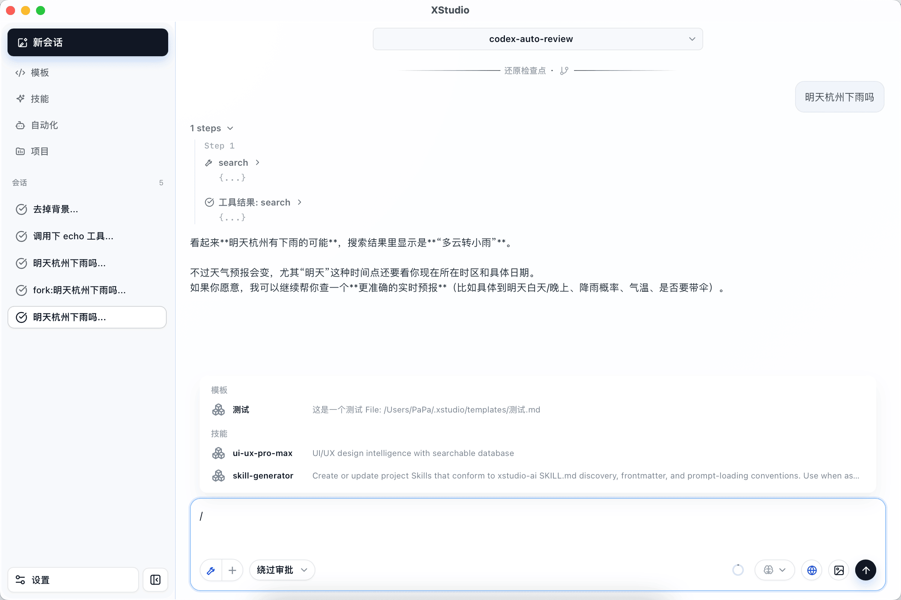
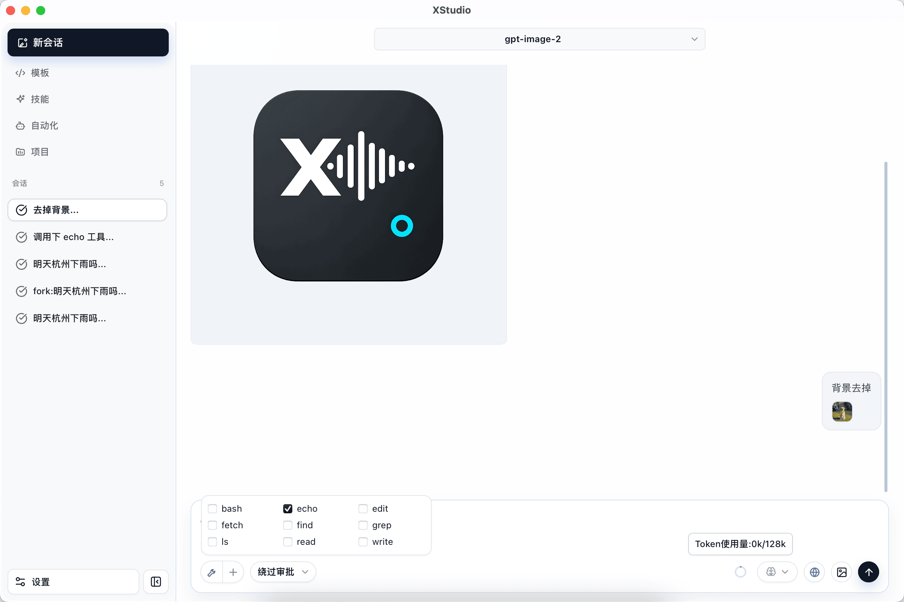
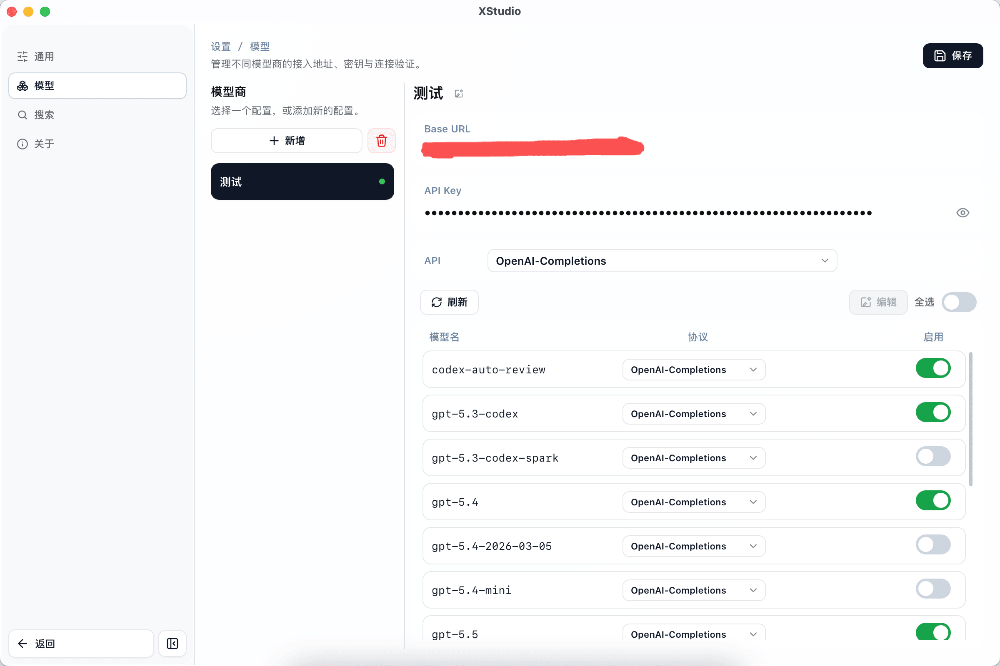

<p align="center">
	
</p>

**永久免费，从 AI loop 流程到 Tool、模型协议，提供最大自由度的插件定制。**

# XStudio

**XStudio** 是一个本地桌面 AI 编程助手。它使用 Tauri 2、React 和 Rust 构建，提供面向项目的多轮 Agent 会话、模型与 Provider 管理、内置开发工具、搜索、Skills、模板和原生插件扩展能力。

> 当前项目处于早期开发阶段，接口、存储格式和插件协议可能继续演进。

<p align="center">
	
	
	
</p>

## 功能

- **Agent 会话**：创建、打开、删除会话；支持多轮消息、终止运行、编辑、回撤与 Fork。
- **模型管理**：管理 Provider 与模型列表，支持从 Provider 拉取远端模型，并设置模型及思考档位偏好。
- **本地工具**：内置 Bash、文件读写与精确编辑、目录与内容检索，以及多搜索引擎聚合。
- **资源中心**：管理项目、模板与 Skills，为 Agent 提供可复用的提示和工作流资源。将模板放入“设置 → 通用 → 应用路径”按钮打开的目录中的 `templates/` 下，即可在应用中使用。
- **本地持久化**：桌面端保存配置、模型、项目和会话；Harness 支持内存、JSONL 与 SQLite 会话后端。
- **原生插件**：启动时加载动态库，可扩展执行环境、模型 Provider、Agent 工具、搜索引擎及 Harness hooks。

## 技术栈

| 层级 | 技术 |
| --- | --- |
| 桌面应用 | [Tauri 2](https://v2.tauri.app/) + Rust |
| 前端 | React 19 + TypeScript + Vite + Tailwind CSS v4 |
| AI 运行时 | 基于 Pi 的设计理念，提供 Rust async Agent、Provider Registry、流式消息与 Harness |
| 本地存储 | SQLite、JSONL、内存会话 |
| 扩展机制 | 版本化 C ABI + UTF-8 JSON 插件协议 |

## 架构

```text
apps/desktop
	├─ src/                 React 桌面界面
	└─ src-tauri/           Tauri 命令、服务、模型和基础设施
			 │
			 ├─ crates/ai       模型 Provider、Agent、Harness、会话与 Skills
			 ├─ crates/tool     内置 Agent 工具与搜索引擎
			 └─ crates/plugins  原生插件发现、加载与宿主适配
plugin-api/               稳定的动态库 ABI 与 JSON 协议
```

桌面后端保持以下单向分层：

```text
commands -> dto
commands -> services -> models -> infra
```

## 快速开始

### 前置要求

- [Rust](https://www.rust-lang.org/tools/install) stable（项目使用 Rust 2021 edition）
- Node.js（建议使用当前 LTS 版本）和 npm
- 当前平台的 [Tauri v2 前置依赖](https://v2.tauri.app/start/prerequisites/)

### 安装依赖并启动

在仓库根目录执行：

```bash
cd apps/desktop
npm install
npm run tauri:dev
```

首次启动后，在 **设置 → 模型** 中添加可用的 Provider 与模型，再创建会话开始使用。

## 构建

构建前端：

```bash
cd apps/desktop
npm run build
```

构建桌面安装包：

```bash
cd apps/desktop
npm run tauri:build
```

## 开发与验证

常用检查命令：

```bash
# 在仓库根目录执行
cargo fmt
cargo check -p ai
cargo check -p tool
cargo check -p plugins -p desktop
git diff --check

# 在 apps/desktop 目录执行
npm run build
```

`crates/ai` 的集成测试位于 `crates/ai/tests/`；工具 crate 的测试位于 `crates/tool/tests/`。

## 工作区结构

```text
apps/desktop/             XStudio 桌面应用
crates/ai/                AI 模型、Agent 与 Harness 运行时
crates/tool/              内置开发工具和搜索能力
crates/plugins/           原生插件宿主运行时
plugin-api/               插件 ABI、清单和调用协议
templates/                模板与生成器资源
```

## 插件

XStudio 在应用数据目录的 `<app_dir>/plugins` 下扫描平台动态库：macOS 使用 `.dylib`、Windows 使用 `.dll`、其他 Unix 使用 `.so`。插件仅在应用启动时加载，替换插件文件后需要重启应用。

插件必须链接 `xstudio-plugin-api` 并导出 `xstudio_plugin_entry_v1`。跨动态库边界仅传递 `#[repr(C)]` 结构体、标量和 UTF-8 JSON 字节。详细的 ABI 约束、插件清单和请求协议见 [`plugin-api/README.md`](./plugin-api/README.md)。

- [插件 API v1](./plugin-api/README.md)

## 交流与支持

如需学习交流或遇到问题，欢迎加入交流群：`1103964726`。

<p align="center">
	
</p>

## 贡献

提交修改前，请保持变更范围聚焦，并完成与改动相关的构建或测试。Rust 代码优先使用借用和 Move，避免没有业务必要的 `.clone()`；错误日志应保留完整上下文。

项目根目录的 Cargo workspace 元数据声明为 `Apache-2.0`；发布或分发前请补充正式的 `LICENSE` 文件。
